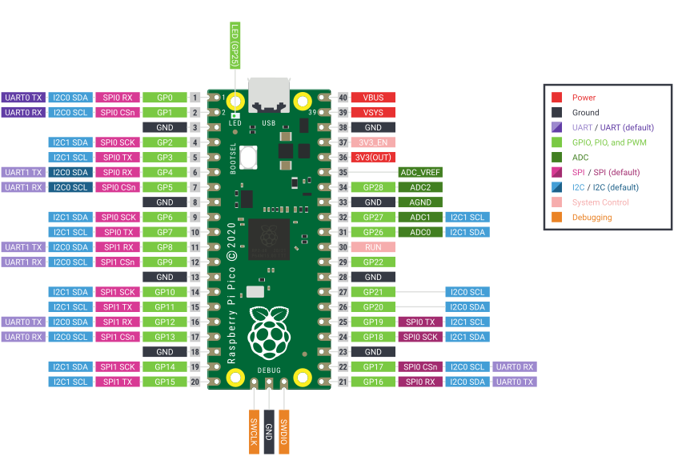

# Library with *Blink* functions for the Pico 

A collection of *blink* functions for the Raspberry Pi Pico that allows you to control the onboard (or external) LED in various ways.

> [!NOTE]
> This repository currently serves no specific purpose other than to assist in testing submodules for another Raspberry Pi Pico C/C++ SDK [project](https://github.com/Googool/unknown).

## Quickstart 🚀

According to the pinout of the Raspberry Pi Pico, the onboard LED is connected to the GP25 pin, which is also capable of doing Pulse-Width Modulation (PWM). This library includes a **pulsing** function, which can be found inside of the [examples](https://github.com/Googool/pico_blink/tree/main/examples) folder.

## Examples

See the [examples](https://github.com/Googool/pico_blink/tree/main/examples) folder for sample programs that demonstrates how to use this library.

## License

The content and software in this [repository](https://github.com/Googool/pico_blink) are licensed under the [MIT license](https://mit-license.org/).

When submitting pull requests to this repository, it is assumed that you are licensing your contribution under the [MIT license](https://mit-license.org/).
